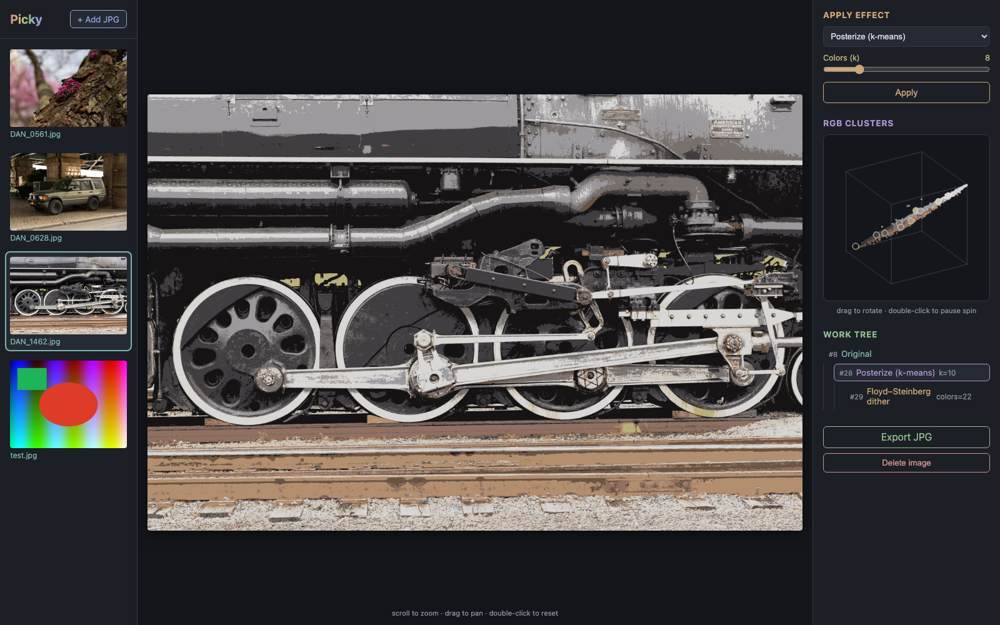

# Picky

A browser-based app for applying visual effects to JPG images, with a git-like
**work tree** per image: every effect you apply creates a child node of the
currently selected node, so you can return to any earlier state and branch off
in a new direction. Images, trees, and rendered results persist across
restarts.



## Features

- **Image catalog** — upload JPGs (file picker or drag-and-drop); everything
  you've loaded stays in the gallery until you delete it.
- **Branching work tree** — effects stack as nodes in a tree, not a linear
  undo history. Click any node to view it or branch from it; delete a node to
  prune it and everything derived from it.
- **Effects**
  - *Posterize* — k-means clustering on RGB values, run in PCA-whitened space
    so clusters spread across color rather than bunching along the luminance
    diagonal. Selecting a posterize node shows a rotatable **3D scatter plot**
    of sampled pixels in RGB space, colored by cluster average.
  - *Tone curve* — a Photoshop-style curves editor. Drag control points on a
    grid drawn over the input's luma **histogram**; they are interpolated with
    a monotone cubic spline, so the curve never overshoots between points and
    never inverts local contrast. Behind the same button, *Gamma* offers the
    one-slider version of the same idea.
  - *Gaussian blur*, *Sobel edges*, *Floyd–Steinberg dither*, *Pixelate*
  - *Blend* — combine the selected node with any other node in the tree using
    average, additive, multiplicative, or subtractive blending.
- **Click to segment** — *Limit to object* confines any effect to one thing
  instead of the whole frame. Hit **Select object** and click the subject; a
  [MobileSAM](https://github.com/ChaoningZhang/MobileSAM) model outlines it,
  the outline shows as an overlay, and the effect then applies inside it and
  leaves the rest of the image alone. A dropdown chooses how much of the
  subject one click means — *auto (best match)*, or explicitly *whole*,
  *part*, or *subpart* — and **invert** flips the region, so the effect hits
  the background instead. The selection is saved with the node (masked nodes
  are marked in the work tree), so editing the effect's params later
  re-composites against the same region. Model weights (~45 MB) download on
  first use.
- **Presets** — save the chain that produced a node as a named recipe and
  replay it on any other image. A preset stores its steps with *relative*
  parent references, not node ids, so a branching recipe (say `edges` blended
  back onto the original) reproduces its shape on whatever node you apply it
  to. Applying one is all-or-nothing: if any step fails, the nodes it already
  created are rolled back.
- **Preview zoom** — scroll to zoom (cursor-anchored), drag to pan,
  double-click to reset.
- **Export** — download any node's render as a JPG named after its effect
  chain (e.g. `photo-posterize-blur.jpg`).
- **Library stats** — image, node, and preset counts plus disk usage. The
  render cache is reported apart from the database and originals: it is ~85%
  of the bytes and regenerates on demand, so a single "on disk" figure would
  badly misstate what you would actually lose.

## Setup

Requires Python 3.13 (see `.tool-versions`).

```sh
python3 -m venv .venv
.venv/bin/pip install -r requirements.txt
```

## Run

```sh
.venv/bin/uvicorn server.main:app --port 8000
```

Then open <http://localhost:8000>. Uploaded originals, the SQLite database,
and cached renders live in `data/` (gitignored).

The segmentation models are fetched to `data/models/` the first time you use
click-to-segment, from a revision-pinned Hugging Face URL. To supply your own
ONNX exports instead, point `PICKY_SAM_ENCODER` and `PICKY_SAM_DECODER` at
them; nothing else in the app requires the download.

## Architecture

```
server/
  main.py       FastAPI routes + static file serving
  db.py         SQLite schema and queries (images, nodes)
  effects.py    effect registry: each effect maps an RGB numpy array -> array
  rendering.py  node render pipeline with per-node JPEG cache
  sam.py        MobileSAM via onnxruntime: click a point, get a mask
web/
  index.html, app.js, style.css   vanilla JS single-page frontend
```

Each work-tree node stores its parent, effect name, and parameters; renders
are materialized at node creation and re-derived lazily if a cache file is
missing. Blend nodes carry a second parent reference (`parent2_id`), and
deleting a node cascades through both parent links.

Effects declare their parameter specs (range, default) in the registry, and
the frontend generates its controls from `GET /api/effects` — adding a new
effect is a single entry in `server/effects.py`.

Segmentation splits into a heavy image encoder and a light prompt decoder.
The encoder's output is cached per node alongside its render, so the cost is
paid once per node no matter how many points you click; each click is then
only the decoder. A stored selection is re-decoded rather than saved as
pixels, which keeps it exact when a node's params are edited.

## API

| Method | Path | Purpose |
|--------|------|---------|
| GET    | `/api/effects` | effect registry with parameter specs |
| POST   | `/api/images` | upload a JPG (multipart) |
| GET    | `/api/images` | list images |
| GET    | `/api/images/{id}/tree` | all work-tree nodes for an image |
| POST   | `/api/images/{id}/nodes` | apply an effect (`parent_id`, `effect`, `params`, optional `parent2_id` for blend, optional `selection` to mask it) |
| PATCH  | `/api/nodes/{id}` | edit a node's `params`, `parent2_id`, or `selection` in place, re-rendering it and dropping its descendants' caches |
| GET    | `/api/nodes/{id}/render` | rendered JPEG (`?thumb=1` thumbnail, `?download=1` attachment) |
| POST   | `/api/nodes/{id}/preview` | render an effect on top of a node in memory — no node created, nothing cached |
| POST   | `/api/nodes/{id}/mask` | segment a click (`x`, `y`, optional `invert`, `level`) into a mask PNG; persists nothing but the node's cached embedding |
| GET    | `/api/nodes/{id}/clusters` | k-means scatter data for posterize nodes |
| GET    | `/api/nodes/{id}/histogram` | 256-bin luma histogram of a node's render, for the tone-curve editor's backdrop |
| DELETE | `/api/nodes/{id}` | delete a node and everything derived from it |
| DELETE | `/api/images/{id}` | delete an image, its tree, and its files |
| GET    | `/api/presets` | list saved presets with their steps |
| POST   | `/api/presets` | save a node's ancestor chain as a preset (`name`, `node_id`) |
| POST   | `/api/nodes/{id}/apply-preset` | replay a preset onto a node (`preset_id`) |
| DELETE | `/api/presets/{id}` | delete a preset |
| GET    | `/api/stats` | library counts and disk usage |
